# Demodex - Work In Progress

Decentralised ERC-20/721/1155 token exchange.

<kbd></kbd>

#### UI URL
[https://bokkypoobah.github.io/Demodex/](https://bokkypoobah.github.io/Demodex/)

#### Testing

Connect to the Sepolia network

##### Setup Token Contract

Go to the Token Contracts tab. Click on [+] to add a new token contract

<kbd>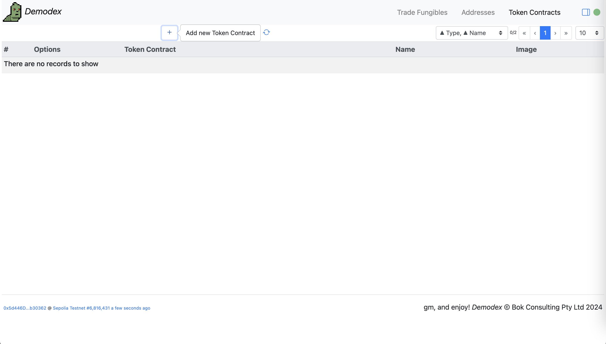</kbd>

Select `0x7439E9Bb6D8a84dd3A23fe621A30F95403F87fB9` `WEENUS` from the dropdown list. Click on [+]

<kbd>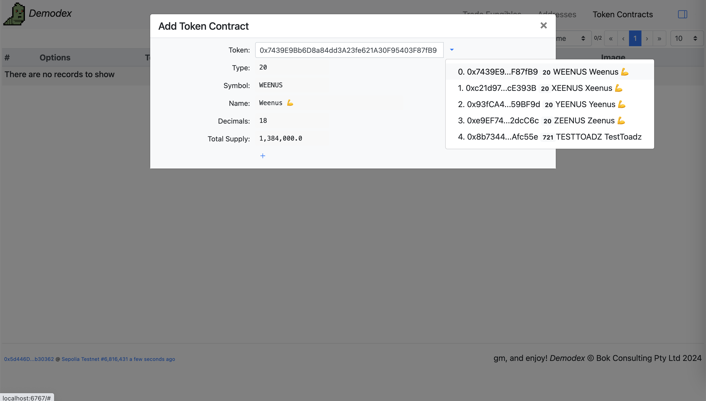</kbd>

`WEENUS` should now be in your list of token contracts.

Note: To mint 1,000 `WEENUS` tokens for testing, send a 0 value transaction to [0x7439E9Bb6D8a84dd3A23fe621A30F95403F87fB9](https://sepolia.etherscan.io/address/0x7439E9Bb6D8a84dd3A23fe621A30F95403F87fB9#code) on Sepolia.

<kbd>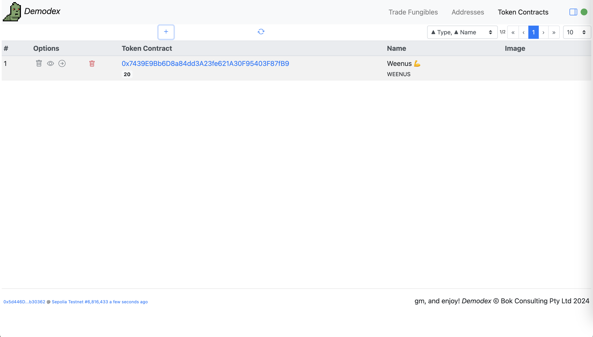</kbd>

Click on the [->] icon to permit usage of this token

<kbd>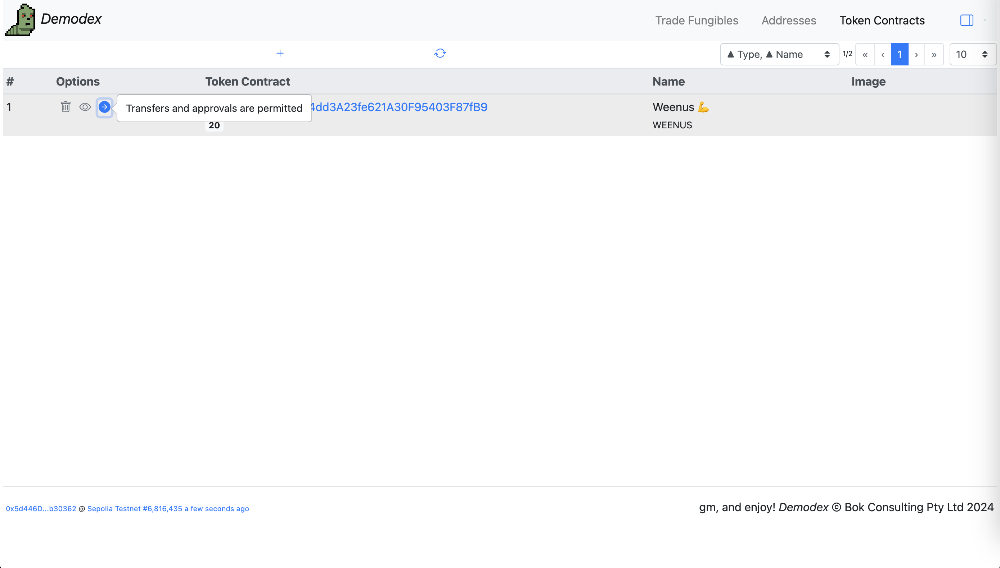</kbd>

<br />

##### Trade Fungibles

Go to the Trade Fungibles tab. Select the `WEENUS` token from the dropdown. Click on the [circular-arrow] icon to Sync

<kbd>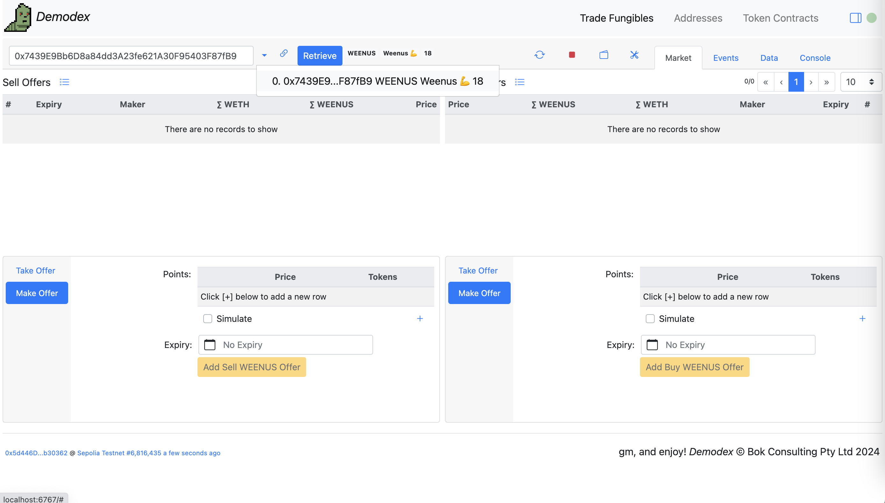</kbd>

###### Make Offer

Click on the [Make Offer] tab in the Sell Offers pane. Click on [+] to add a new point. Add in a price and number of tokens. Select an expiry datea and time. Tick Simulate to display your proposed offer in the Sell Offers table.

<kbd>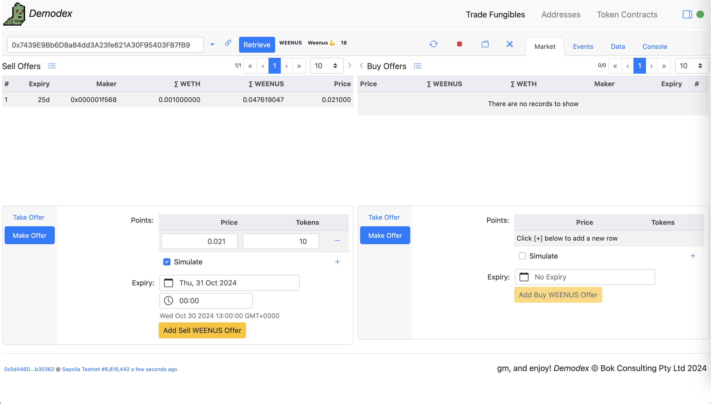</kbd>

Click [Add Sell WEENUS Offer] and [Confirm] in your web3 wallet

<kbd>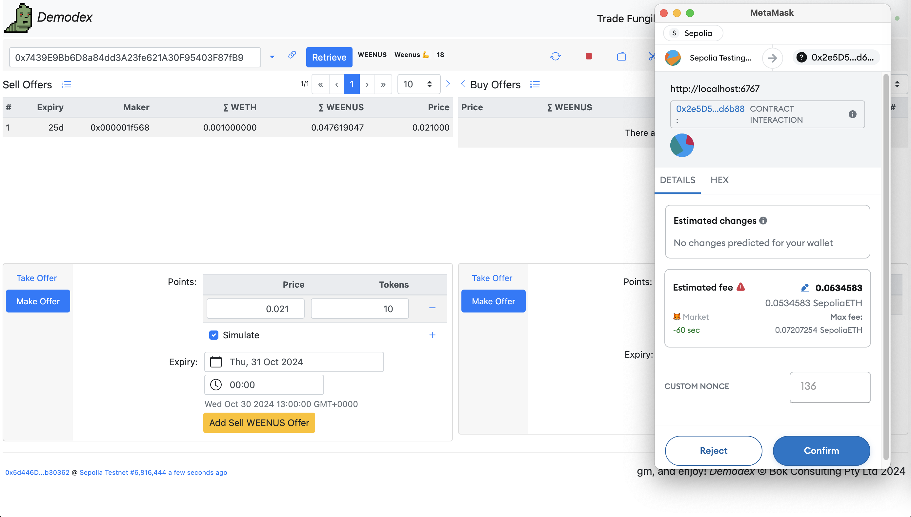</kbd>

Click on the transaction hash link to view the transaction in the block explorer. https://sepolia.etherscan.io/tx/0xc30fe3749b988d5adf0fafb4fde275460571816f641b36410d9fc8b93a8352bc for example.

<kbd></kbd>

Click on the [circular-arrow] icon to Sync. Your new offer should appear, a duplicate of the simulated offer.

<kbd>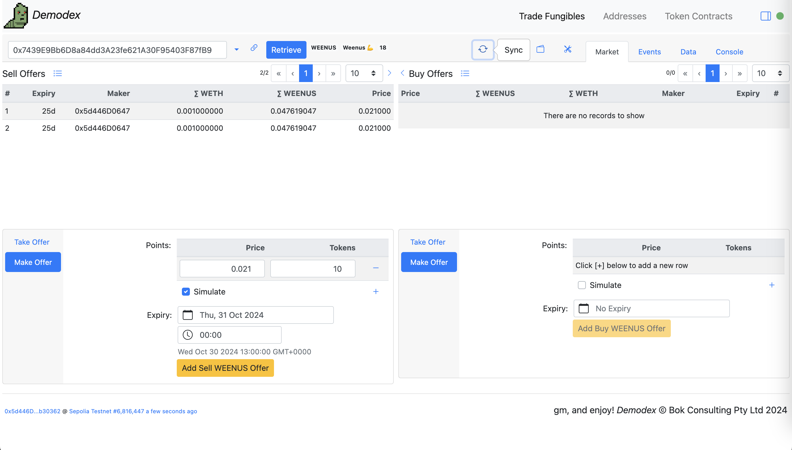</kbd>

Un-tick Simulate

<kbd>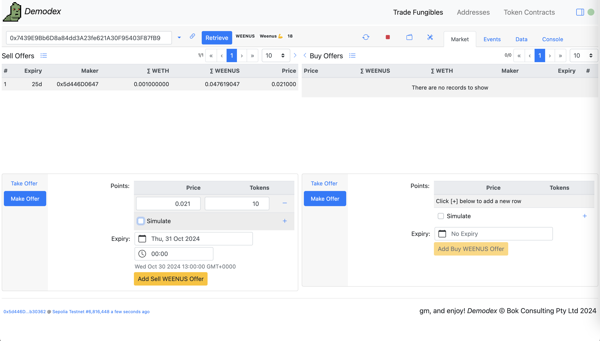</kbd>

Adding a Buy Offer

<kbd>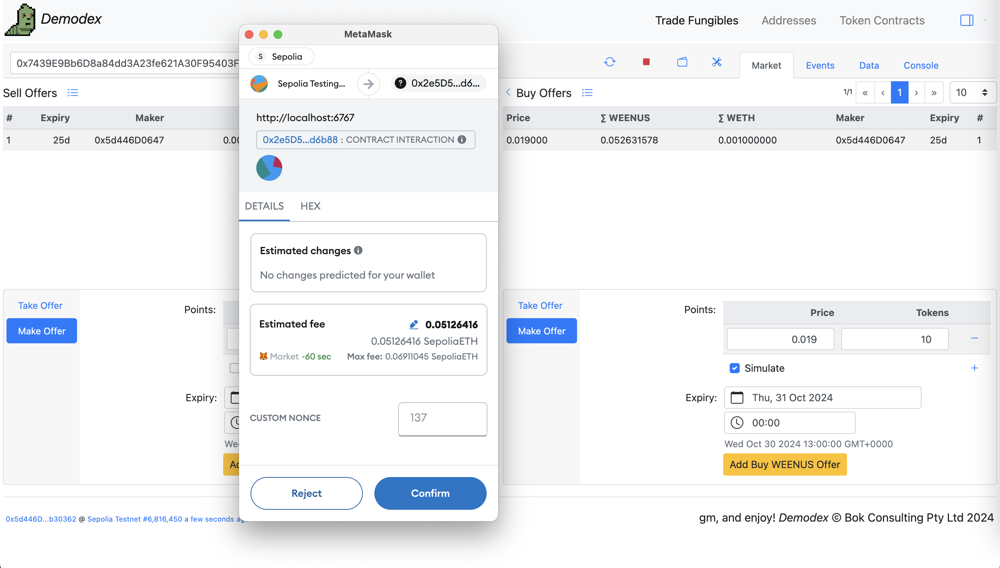</kbd>

Click on the [circular-arrow] icon to Sync after adding.

<kbd>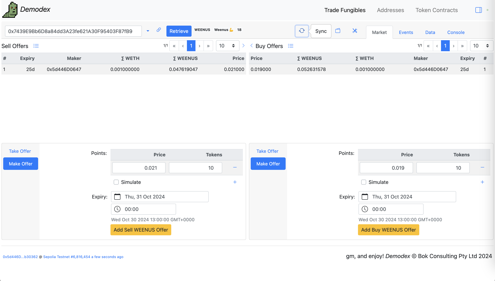</kbd>

<br />

###### Take Offer

Taking a Buy Offer. Enter requested amount and click [Sell WEENUS].

Note:
* You will have to have a WETH balance to purchase WEENUS tokens, and a WEENUS balance to sell WEENUS tokens
* You will have to approve for Demodex to transfer your WETH and/or WEENUS tokens. See below for approvals.

<kbd>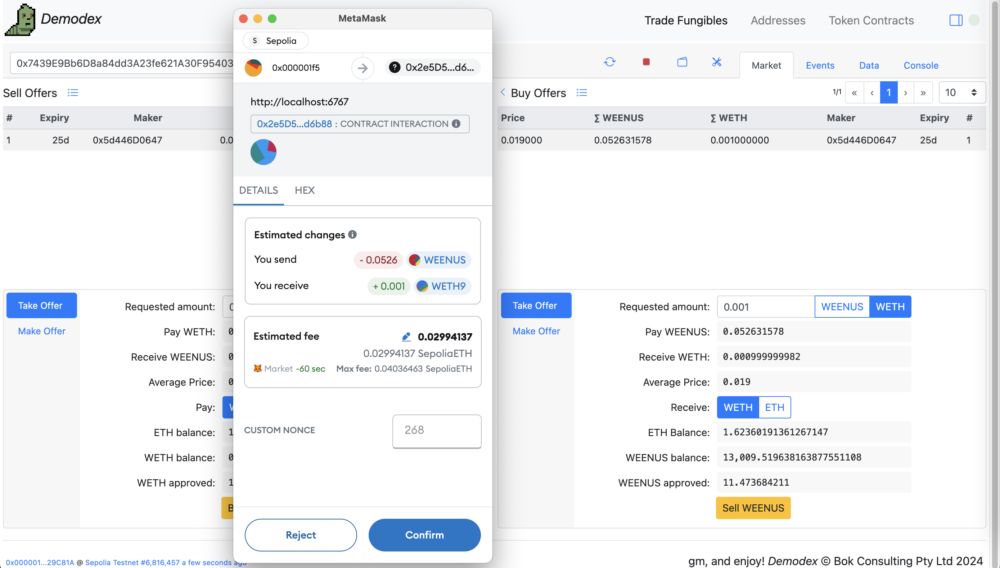</kbd>

The Events tab shows the offers, trades and related transfers

<kbd>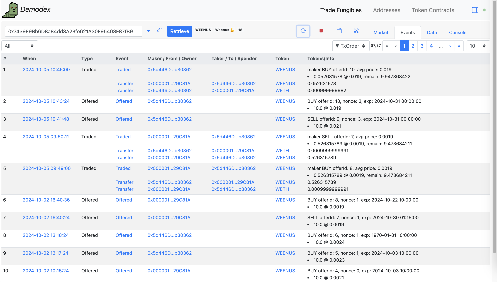</kbd>

<br />

###### Approvals

Click on the [Wallet] icon to view and/or set your token balances and approvals

<kbd>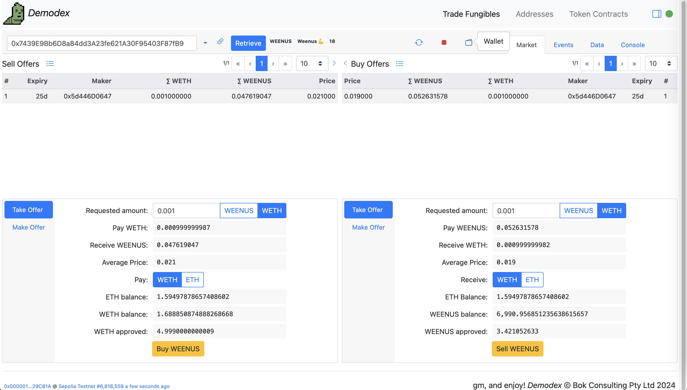</kbd>

Enter amounts in the appropriate fields and click the associated button to update.

Note: To mint 1,000 `WEENUS` tokens for testing, send a 0 value transaction to [0x7439E9Bb6D8a84dd3A23fe621A30F95403F87fB9](https://sepolia.etherscan.io/address/0x7439E9Bb6D8a84dd3A23fe621A30F95403F87fB9#code) on Sepolia.

<kbd>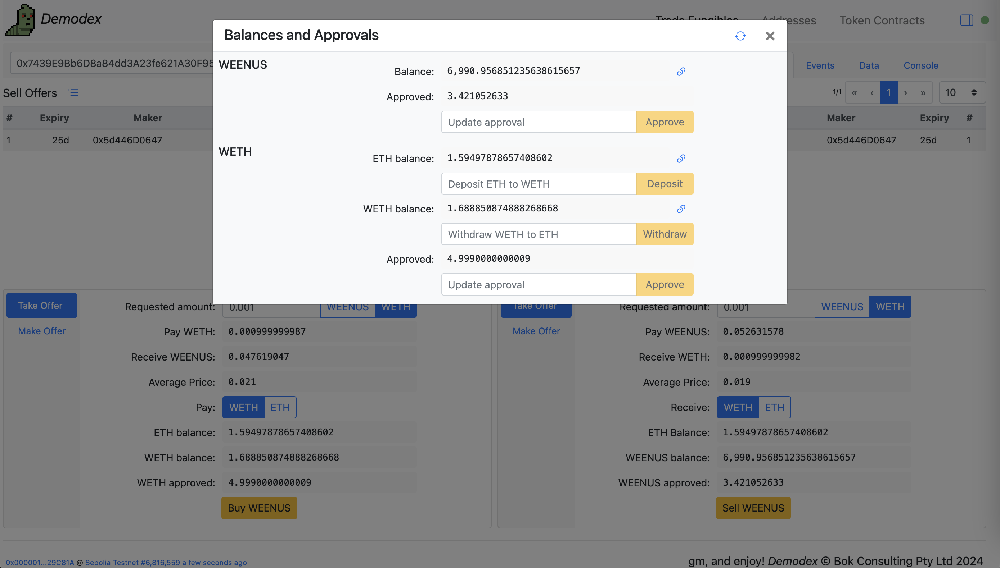</kbd>


<br />

---

#### Deployments

* v0.8.0 [Demodex](https://sepolia.etherscan.io/address/0x2e5D59C1b7da9324eD29891BA060866948dd6b88#code) using [WETH](https://sepolia.etherscan.io/address/0x07391dbE03e7a0DEa0fce6699500da081537B6c3#code) - [deployed/Demodex_Sepolia_0x2e5D59C1b7da9324eD29891BA060866948dd6b88.sol](deployed/Demodex_Sepolia_0x2e5D59C1b7da9324eD29891BA060866948dd6b88.sol)

<br />

---

#### Testing

##### First Install
Clone/download this repository, and in the new folder on your computer:

```bash
npm install --save-dev hardhat
```

##### Run Test Script

Or run the test with the output saved in [./testIt.out](./testIt.out).
You may initially have to mark the script as executable using the command `chmod 700 ./10_testIt.sh`.

```bash
$ ./10_testIt.sh
```

<br />

<br />

Enjoy!

(c) BokkyPooBah / Bok Consulting Pty Ltd 2024. The MIT Licence.
