# Demodex - Work In Progress

Decentralised ERC-20/721/1155 token exchange.

<kbd>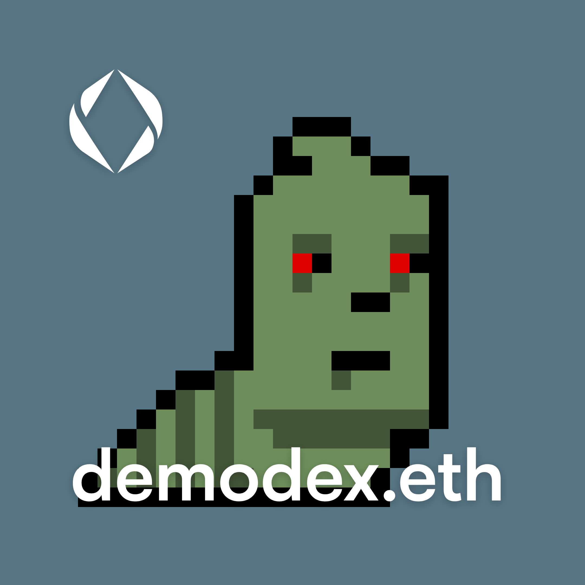</kbd>

#### UI URL
[https://bokkypoobah.github.io/Demodex/](https://bokkypoobah.github.io/Demodex/)

#### Testing

Connect to the Sepolia network

##### Setup Token Contract

Go to the Token Contracts tab. Click on [+] to add a new token contract

<kbd>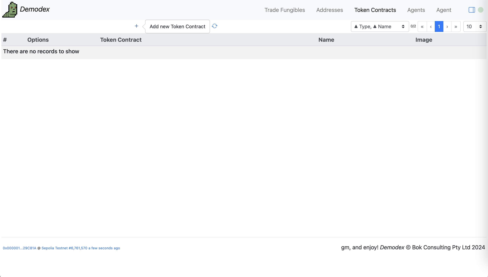</kbd>

Select `0x7439E9Bb6D8a84dd3A23fe621A30F95403F87fB9` `WEENUS` from the dropdown list. Click on [+]

<kbd>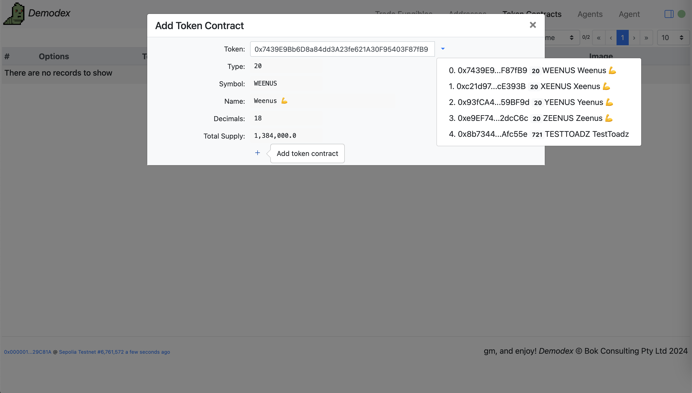</kbd>

Click on the [->] icon to permit usage of this token

<kbd>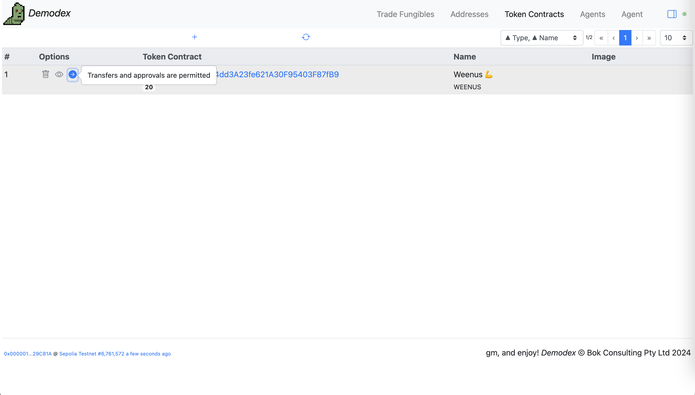</kbd>

<br />

##### Trade Fungibles

Go to the Trade Fungibles tab. Select the `WEENUS` token from the dropdown. Click on the [circular-arrow] icon to Sync

<kbd>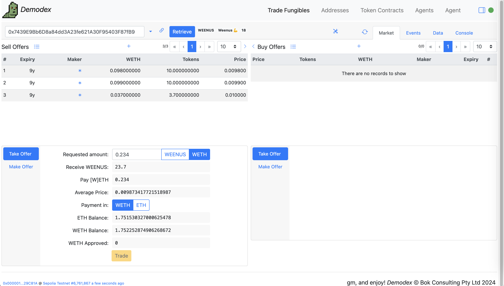</kbd>

###### Take Offer

Click on the [right arrow] in the Sell Offers pane to expand the Sell Offers table. Enter an amount in ETH, with Payment in ETH

<kbd>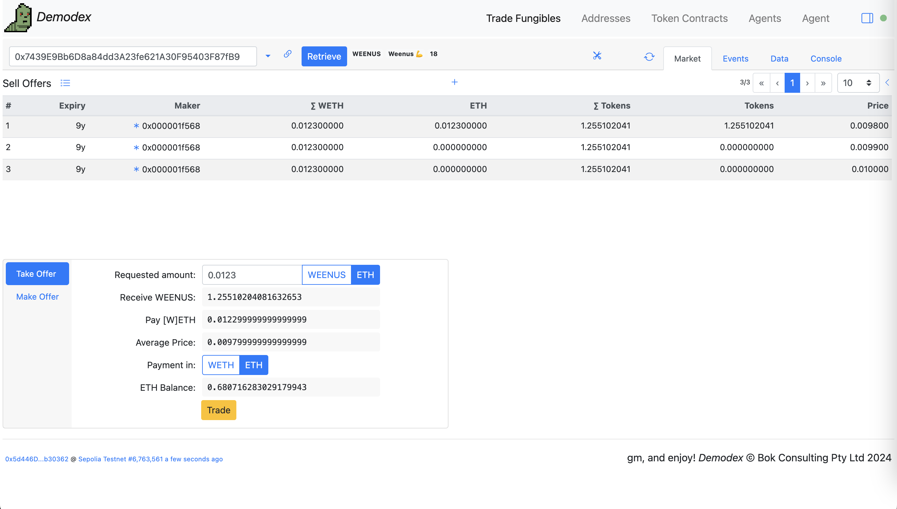</kbd>

Click [Trade] and [Confirm] in your web3 wallet

<kbd>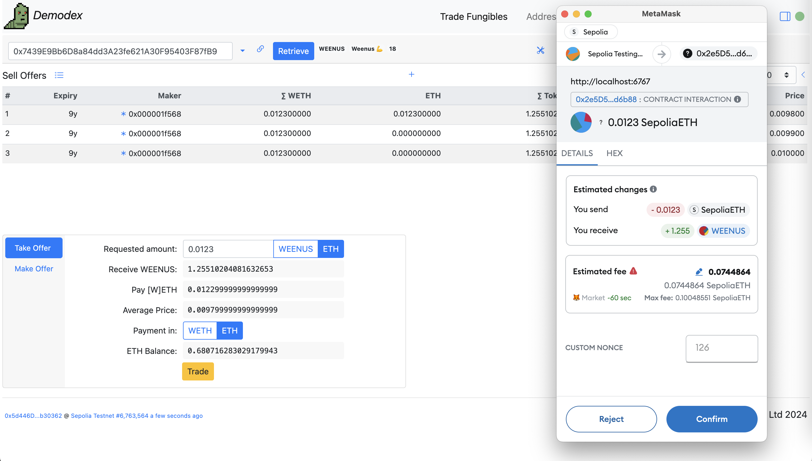</kbd>

Click on the transaction hash link to view the transaction in the block explorer

<kbd>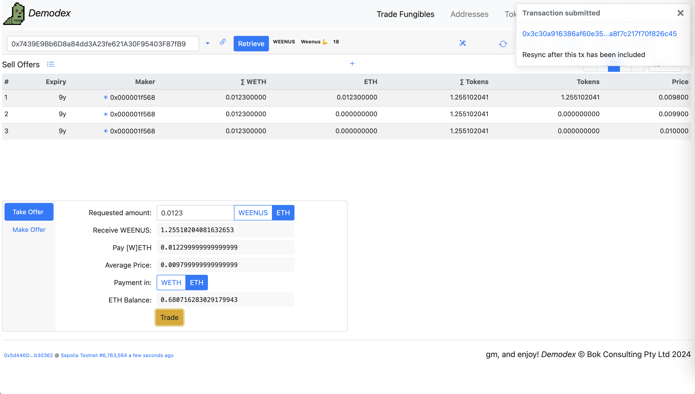</kbd>

https://sepolia.etherscan.io/tx/0x3c30a916386af60e3566e3ecbfce41aae2d40d5d92ab5ba8f7c217f70f826c45

<kbd>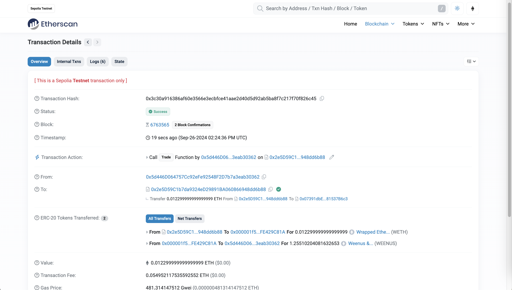</kbd>

The Trade event log

<kbd>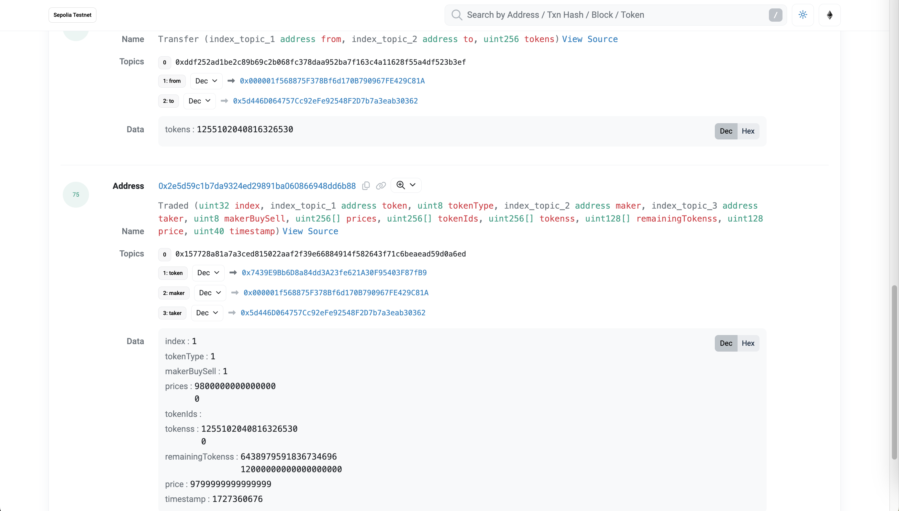</kbd>

Click on the [circular-arrow] icon to Sync

<kbd>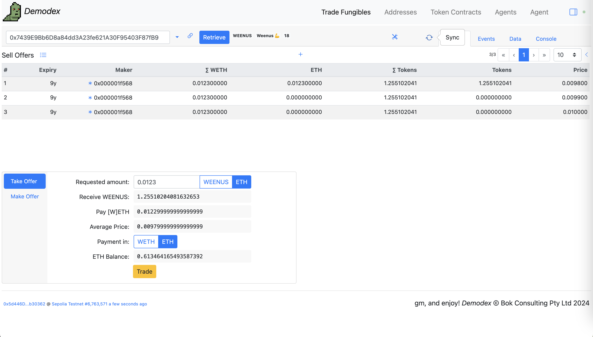</kbd>

View the Offered, Traded, Transfer and Approval events in the Events tab

<kbd>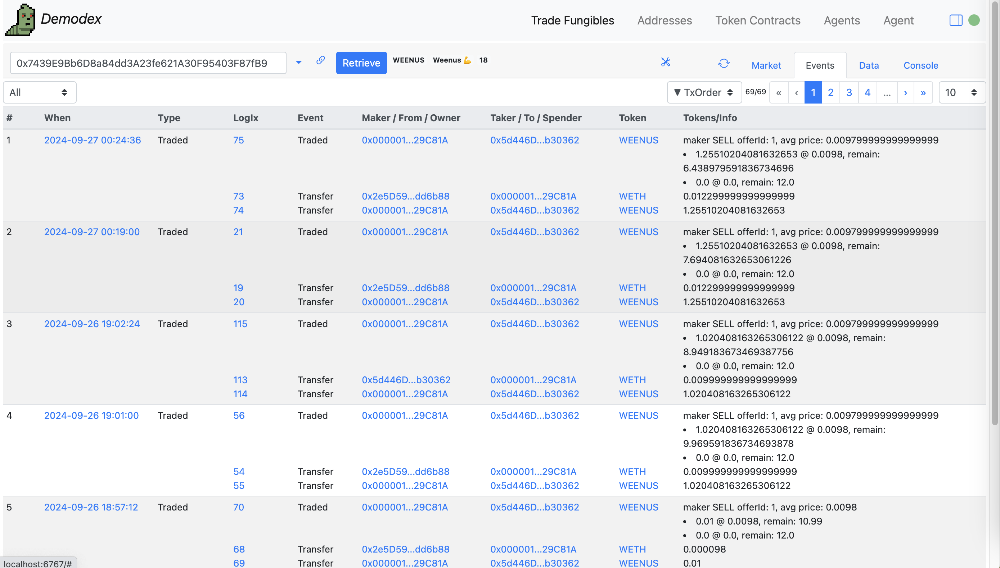</kbd>

<br />

###### Make Offer

Click on the Make Offer pane. Enter (price, token) points. Set the Simulate checkbox to view your price points among the existing offers

<kbd>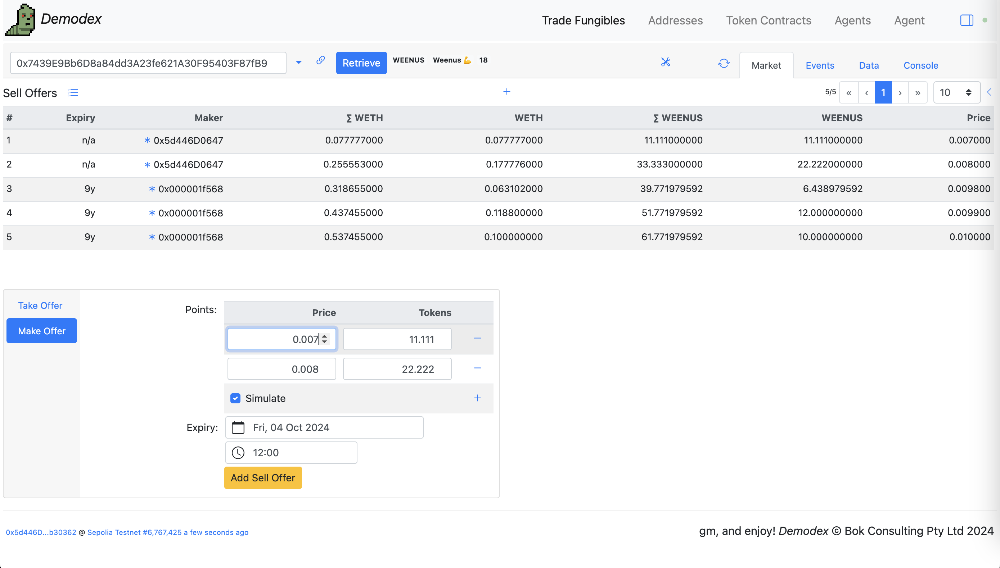</kbd>

Click [Add Sell Offer] and confirm in your web3 wallet

<kbd>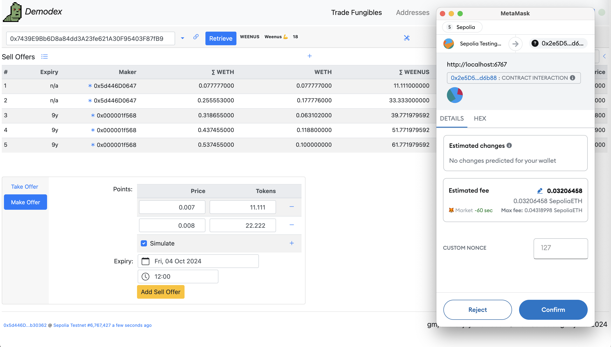</kbd>

The transaction hash is displayed on the top right

<kbd>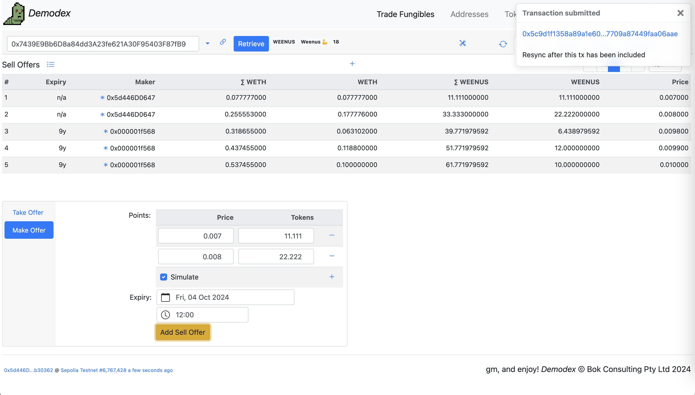</kbd>

https://sepolia.etherscan.io/tx/0x5c9d1f1358a89a1e60100f6dccb686454688586fff12037709a87449faa06aae#eventlog

<kbd>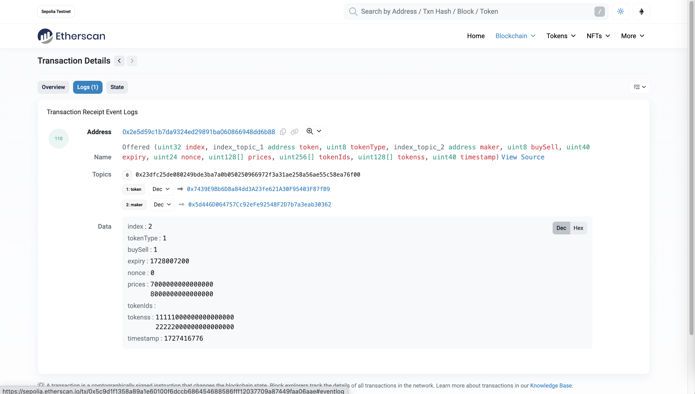</kbd>

After syncing, and un-checking the Simulate checkbox

<kbd>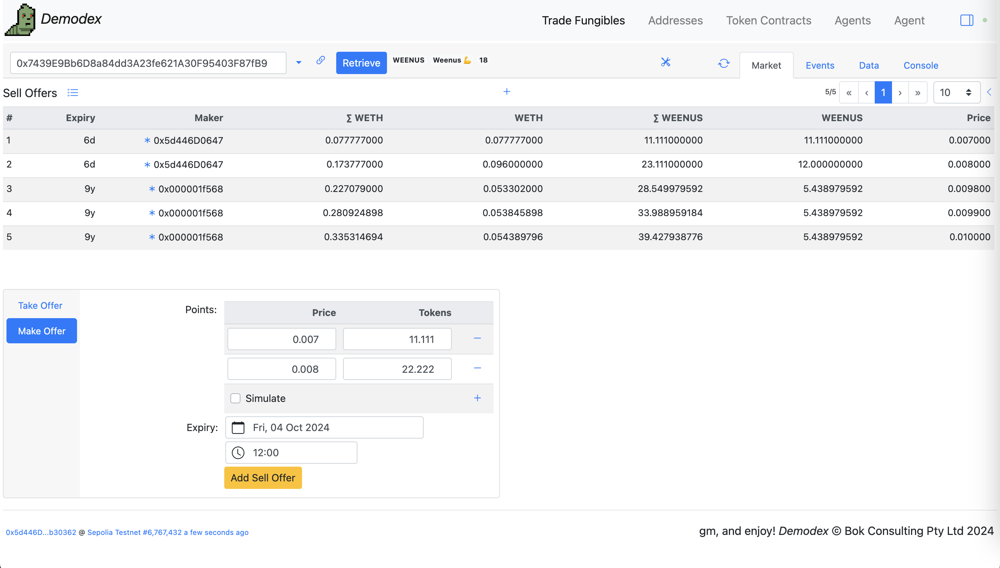</kbd>

<br />

---

#### Deployments

* v0.8.0 [Demodex](https://sepolia.etherscan.io/address/0x2e5D59C1b7da9324eD29891BA060866948dd6b88#code) using [WETH](https://sepolia.etherscan.io/address/0x07391dbE03e7a0DEa0fce6699500da081537B6c3#code) - [deployed/Demodex_Sepolia_0x2e5D59C1b7da9324eD29891BA060866948dd6b88.sol](deployed/Demodex_Sepolia_0x2e5D59C1b7da9324eD29891BA060866948dd6b88.sol)

<br />

---

#### Testing

##### First Install
Clone/download this repository, and in the new folder on your computer:

```bash
npm install --save-dev hardhat
```

##### Run Test Script

Or run the test with the output saved in [./testIt.out](./testIt.out).
You may initially have to mark the script as executable using the command `chmod 700 ./10_testIt.sh`.

```bash
$ ./10_testIt.sh
```

<br />

<br />

Enjoy!

(c) BokkyPooBah / Bok Consulting Pty Ltd 2024. The MIT Licence.
